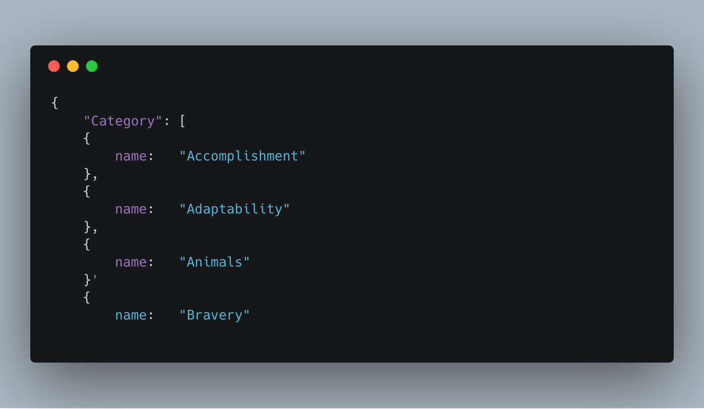
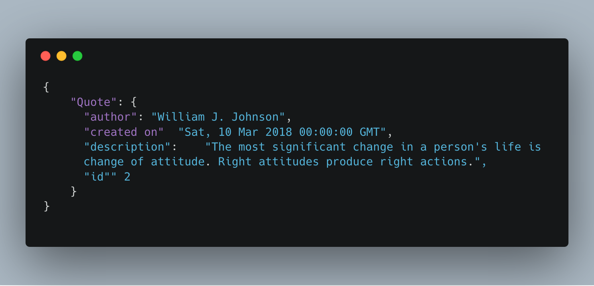

# Pot of Quotes
> "Wise men learn more from fools than fools from wise men" – Cato 

A web application that provides a list of quotes within a variety of categories as well provides a user registration and 
authentication system. This application uses persistent data storage to create a RESTful web application that allows users
 to perform Read, Create, Update, and Delete operations.

The registration and authentication its done using OAuth 2.0 to access Google API and utilize Google Sign-In. 
The application also provides three secured JSON Endpoints.

## Implementation

- Python 2.7
- Jinja2
- Flask
- SQLAlchemy
- JSON
- OAuth2 authorization protocol
- Google API
 
## Installation
_To run, develop and test the application locally the following are needed._

1. Install [Vagrant](https://www.vagrantup.com/) and [Virtual Box](https://www.virtualbox.org/wiki/Downloads)
2. Clone **pot-of-quotes-app**
3. Launch the Vagrant VM 
    - `vagrant up`
    - `vagrant ssh`
    - `cd /vagrant`
4. Work on the Flask application locally in the vagrant directory
5. Run application within the VM.
    - `python application.py`
6. Access and test application by visiting `http://localhost:8000` locally.

## JSON Endpoints

> Endpoint `/api/v1/categories` Returns a list of all the categories.

> Endpoint `/api/v1/categories/quotes` Returns a list of all the quotes under a category.
> Endpoint `/api/v1/categories/quotes/1` Returns a single quote under a category.

## Restful Endpoints
#### CRUD for Quotes
`/categories/<string:category_name>/quotes/new`

`/categories/<string:category_name>/quotes/<int:quote_id>/edit`

`/categories/<string:category_name>/quotes/<int:quote_id>/delete`

## Sign-In with Google
`'/login'`

## TODO
- Sign Up
- like functionality
- Ability to add background images
- Share functionality

## ISSUES with 
`http:potofquotes.pythonanywhere.com`
 - Sign In not working
  * Secret Key missing
- Broken "newQuote" link 